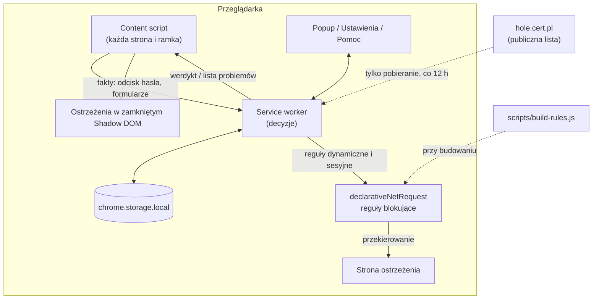

# CyberGuard: czym jest, po co jest i jak działa

> Wersja 2.0 · Chrome i Edge (Manifest V3) · stan na październik 2026
> Instrukcja testowania: [testowanie.md](testowanie.md)

## Spis treści

1. [Po co jest CyberGuard](#1-po-co-jest-cyberguard)
2. [Dla kogo i jakie przyjęliśmy zasady](#2-dla-kogo-i-jakie-przyjęliśmy-zasady)
3. [Co widzi użytkownik](#3-co-widzi-użytkownik)
4. [Jak to działa (technicznie)](#4-jak-to-działa-technicznie)
5. [Prywatność i bezpieczeństwo danych](#5-prywatność-i-bezpieczeństwo-danych)
6. [Uprawnienia i dlaczego są potrzebne](#6-uprawnienia-i-dlaczego-są-potrzebne)
7. [Przed czym chroni, a przed czym nie](#7-przed-czym-chroni-a-przed-czym-nie)
8. [Ograniczenia](#8-ograniczenia)
9. [Utrzymanie i rozwój](#9-utrzymanie-i-rozwój)
10. [Co zmieniło się względem wersji 1.x](#10-co-zmieniło-się-względem-wersji-1x)

---

## 1. Po co jest CyberGuard

Większość oszustw w polskim internecie zaczyna się tak samo: SMS albo e-mail z linkiem, np. o „dopłacie do paczki InPost”, „blokadzie konta w banku” czy „zwrocie podatku”. Link prowadzi do strony, która wygląda jak prawdziwa. Ofiara wpisuje tam hasło do banku, dane karty lub kod BLIK.

CyberGuard przerywa ten scenariusz w czterech miejscach:

| Moment | Co robi CyberGuard |
|---|---|
| **Kliknięcie w link, którego napis udaje inny adres** | Gdy na linku widać `www.mbank.pl`, a naprawdę prowadzi do `mbank-weryfikacja.xyz`, kliknięcie jest wstrzymane i pojawia się porównanie obu adresów. |
| **Wejście na znaną oszukańczą stronę** | Blokuje ją i pokazuje zrozumiałe ostrzeżenie zamiast strony. Korzysta z listy CERT Polska (polskie oszustwa) i OpenPhish (międzynarodowe). |
| **Wejście na nową, jeszcze nieznaną podróbkę** | Rozpoznaje adresy udające znane firmy (`mbank-logowanie.com`, `allegro.pl-oferta24.xyz`, `pаypal.com` z cyrylicą) i ostrzega. |
| **Wpisywanie hasła w złym miejscu** | Gdy hasło używane w banku, na poczcie albo w urzędzie zaczyna być wpisywane na obcej stronie, pojawia się blokujące okno, zanim formularz zostanie wysłany. |

Do tego dochodzi pomoc **po** oszustwie: przycisk „Oszust może mieć moje dane – co robić?” prowadzi do prostej listy kroków (bank, zastrzeżenie PESEL, zgłoszenie do CERT Polska, policja).

## 2. Dla kogo i jakie przyjęliśmy zasady

**Główna grupa:** osoby mniej obeznane z technologią, w tym seniorzy, po polsku. Angielski jest językiem drugim, wybieranym automatycznie według języka przeglądarki.

**Zasady projektowe:**

1. **Zero konfiguracji.** Po instalacji wszystko działa. Nie trzeba niczego oznaczać, rozumieć ani ustawiać.
2. **Jeden oczywisty, bezpieczny wybór.** Największy, zielony przycisk zawsze prowadzi w bezpieczne miejsce („Zabierz mnie stąd”). Opcje ryzykowne są małe i wymagają potwierdzenia.
3. **Nie krzyczeć bez potrzeby.** Ostrzeżenie pojawia się tylko wtedy, gdy realnie coś grozi. Ktoś zasypywany banerami nauczy się je zamykać bez czytania i przeoczy ten jeden ważny.
4. **Prosty język.** Bez słów „phishing”, „domena”, „certyfikat”. Polskie teksty są neutralne płciowo („Wpisujesz hasło…”, a nie „Wpisałeś…”).
5. **Czytelność.** Tekst min. 18 px, kontrast na poziomie WCAG AAA, przyciski o wysokości min. 52 px, widoczny fokus klawiatury, tryb jasny i ciemny.
6. **Prywatność.** Wszystko dzieje się na komputerze użytkownika. Hasła nie są nigdzie zapisywane ani wysyłane.

## 3. Co widzi użytkownik

### 3.1 Strona ostrzeżenia (zablokowana strona z listy)

Czerwona karta „Stop! Ta strona może Cię oszukać”, adres zablokowanej strony, źródło (CERT Polska / OpenPhish) i duży przycisk **„Zabierz mnie w bezpieczne miejsce”** (otwiera stronę startową). Pod spodem:

- „Co to znaczy?”: trzy zdania o tym, jak działają takie oszustwa,
- „Dane mogły już trafić na tę stronę?”: link do strony pomocy,
- mały link **„Wiem, co robię – chcę wejść mimo to”**: wymaga zaznaczenia „Rozumiem, że ta strona może ukraść moje dane lub pieniądze” i odczekania 5 sekund. Odblokowanie działa **tylko do zamknięcia przeglądarki**, a na odblokowanej stronie cały czas widać czerwony baner.

### 3.2 Okno „Stop! To może być oszustwo” (hasło)

Pojawia się w trakcie wpisywania hasła, gdy to hasło jest używane w ważnym serwisie, a obecna strona do niego nie należy:

> **Stop! To może być oszustwo**
> Wpisujesz hasło, którego używasz w serwisie **mBank** (**mbank.pl**).
> Ale ta strona to **super-promocje24.com** – to NIE jest **mBank**.
> [ Zabierz mnie stąd ]
> To jest moja zaufana strona

„Zabierz mnie stąd” czyści pola haseł i przenosi na zieloną stronę „Dobrze! Podejrzana strona jest zamknięta”. „To jest moja zaufana strona” ma drugi krok z potwierdzeniem i podpowiedzią, żeby przy zakładaniu nowego konta wymyślić inne hasło. Dopóki użytkownik nie wybierze, formularz nie zostanie wysłany.

### 3.3 Wskazówka bezpieczeństwa (hasło)

Gdy zwykłe hasło jest używane także na innej zwykłej stronie, np. na dwóch forach, w rogu pojawia się niebieska, niczego nieblokująca wskazówka: „To samo hasło jest używane także na: forum-wedkarskie.pl. Bezpieczniej mieć inne hasło na każdej stronie.”

### 3.3a Okno „Uwaga: ten link prowadzi gdzie indziej”

Pojawia się po kliknięciu linku, którego **napis wygląda jak adres** (`www.mbank.pl`, `https://allegro.pl/oferta`), a który **naprawdę prowadzi do innej firmy**:

> **Uwaga: ten link prowadzi gdzie indziej**
> Napis na linku: **mbank.pl**
> Link naprawdę prowadzi do: **mbank-weryfikacja.xyz**
> [ Nie otwieraj tego linku ]
> Otwórz mimo to

Domyślnym wyborem (także pod klawiszem Esc) jest „Nie otwieraj”. „Otwórz mimo to” otwiera link tak, jak został kliknięty, czyli w tej samej albo nowej karcie. Okno **nie** pojawia się, gdy:
- napis nie jest adresem („Kliknij tutaj”, e-mail, nazwa pliku `raport.pdf`),
- napis i cel należą do tej samej firmy (`pkobp.pl` → `ipko.pl`, `allegro.pl` → `allegrolokalnie.pl`, `mbank.pl` → `online.mbank.pl`),
- link w poczcie jest opakowany przez przekierowanie usługi pocztowej (Outlook „Safe Links”, Google, Facebook, LinkedIn, YouTube). Sprawdzany jest prawdziwy cel, a okno pokazuje prawdziwy cel, a nie adres pośrednika.

Linki skrócone (`bit.ly`) i śledzące z newsletterów, których napis udaje adres, **wywołują** ostrzeżenie. To zgodne z prawdą: link prowadzi gdzie indziej, niż pokazuje.

### 3.4 Baner na stronie

Jeden baner u góry strony, który może zawierać kilka problemów naraz:

| Problem | Kiedy | Kolor |
|---|---|---|
| „Uwaga: ta strona może podszywać się pod mBank” | adres udaje znaną firmę | pomarańczowy |
| „Uwaga: podrobiony adres strony” | adres używa liter z innego alfabetu, by udawać firmę | czerwony |
| „Nietypowy adres strony” | adres miesza alfabety, ale nie przypomina żadnej znanej firmy | pomarańczowy |
| „Hasło trafi na inną stronę” | formularz logowania wysyła hasło do innej firmy | pomarańczowy |
| „Ta strona nie jest zabezpieczona” | pole hasła na stronie bez HTTPS (z wyjątkiem routerów i sieci lokalnej) | pomarańczowy |
| „Ta strona jest na liście niebezpiecznych” | strona z listy, odblokowana przez „Wejdź mimo to” | czerwony |

Przyciski na banerze:

| Przycisk | Działanie |
|---|---|
| **Zabierz mnie stąd** | opuszcza stronę (przy podróbkach i stronach z listy) |
| **Ufam tej stronie** | trwale wyłącza ostrzeżenia o tej stronie |
| **Rozumiem, nie pokazuj więcej na tej stronie** | trwale ukrywa *to* ostrzeżenie na *tej* stronie. Jeśli pojawi się inny problem, baner wróci. |
| **×** | zamyka baner tylko teraz |

Ostrzeżenia o stronie z listy oszustw oraz okna „Stop!” przy haśle **nie da się** wyłączyć na stałe.

### 3.5 Ikona na pasku przeglądarki

Na ikonie pojawia się „!”, gdy strona budzi wątpliwości. Po kliknięciu otwiera się okienko ze stanem bieżącej strony:

| Stan | Znaczenie |
|---|---|
| ✓ **Prawdziwa strona: mBank** | adres należy do jednej z ok. 46 znanych firm (lista w kodzie) |
| ✓ **Znana strona** | użytkownik logował się tu wcześniej |
| ? **Nieznana strona** | nic o niej nie wiemy (to nie znaczy, że jest zła) |
| ! **Uwaga na tę stronę** / **Strona bez zabezpieczenia** | podróbka adresu / brak HTTPS |
| ! **Strona z listy niebezpiecznych** | odblokowana przez użytkownika |

Zielony kolor celowo **nie** znaczy „strona jest bezpieczna”, bo bez połączenia z internetem nie da się tego wiedzieć. Znaczy tylko „to prawdziwy adres tej firmy” albo „byłeś tu już”.

Okienko ma też duży przycisk **„Oszust może mieć moje dane – co robić?”**, licznik zatrzymanych stron i datę listy ostrzeżeń.

### 3.6 Strona pomocy „Oszust może mieć moje dane – co teraz?”

Ponumerowane kroki: (1) bank: numer z odwrotu karty, blokada; (2) zmiana haseł, wylogowanie ze wszystkich urządzeń i logowanie dwuetapowe; (3) zastrzeżenie PESEL w mObywatelu / na gov.pl i dowodu w banku; (4) programy zdalnego pulpitu (AnyDesk, TeamViewer); (5) zgłoszenie: incydent.cert.pl, SMS na 8080, policja 112; (6) rozmowa z bliską osobą.

Na dole jest opcjonalne **„Wyczyść ostatnią godzinę”** (historia, ciasteczka, pamięć podręczna, dane formularzy). Przeglądarka pyta o zgodę dopiero w tym momencie, a strona uczciwie informuje, że to nie cofa danych, które już trafiły do oszusta.

### 3.7 Ustawienia

- **Lista niebezpiecznych stron:** włącznik pobierania nowych ostrzeżeń CERT Polska co 12 h, „Sprawdź teraz”, data ostatniej aktualizacji i łączna liczba blokowanych stron z rozbiciem: lista wbudowana w rozszerzenie + domeny dodane przez CERT od tego czasu − domeny wycofane.
- **Zapamiętane hasła:** „Hasło 1 — używane na: mbank.pl, moj-sklep.pl [chronione]”, przycisk „Zapomnij” i „Zapomnij wszystkie”. Same hasła nie są pokazywane, bo nie są przechowywane.
- **Strony z wyłączonymi ostrzeżeniami:** zaufane strony i ukryte ostrzeżenia z przyciskiem „Pokazuj znowu”.
- **Strony odblokowane do zamknięcia przeglądarki** z przyciskiem „Zablokuj ponownie”.

Po instalacji ta sama strona otwiera się raz jako ekran powitalny „CyberGuard już Cię chroni. Nic nie trzeba ustawiać”.

---

## 4. Jak to działa (technicznie)

### 4.1 Architektura



**Zasada podziału:** content script tylko *zbiera fakty* i *pokazuje* to, co każe service worker. Wszystkie decyzje zapadają w jednym miejscu (service worker), a cała logika decyzyjna to czyste funkcje w `src/shared/`, testowane jednostkowo bez przeglądarki.

| Katalog | Zawartość |
|---|---|
| `src/background/` | `service-worker.js` (obsługa wiadomości, cykl życia, ikona), `store.js` (pamięć z kolejką zapisów), `rules.js` (wyjątki sesyjne, aktualizacja listy CERT) |
| `src/content/` | `content.js` (pola haseł, formularze, wstrzymywanie wysyłki, kliknięcia w linki), `ui.js` (okna i banery w zamkniętym Shadow DOM) |
| `src/shared/` | `domain.js` (eTLD+1), `psl-data.js` (Public Suffix List), `punycode.js`, `known-sites.js`, `lookalike.js`, `page-risk.js`, `password-logic.js`, `crypto.js`, `blocklist-filter.js`, `link-text.js`, `link-check.js` |
| `src/pages/` | `warning`, `popup`, `options`, `help`, wspólne `common.css` i `i18n.js` |
| `src/rules/` | reguły generowane przez builder (poza repozytorium) |
| `locales/` | teksty PL/EN do edycji; `scripts/build-locales.js` generuje z nich `src/_locales` |

### 4.2 Blokowanie stron z list

Blokadę realizuje mechanizm przeglądarki **declarativeNetRequest**. Przekierowanie na stronę ostrzeżenia następuje, zanim przeglądarka pobierze cokolwiek z oszukańczej strony. Rozszerzenie nie widzi przy tym, jakie strony odwiedza użytkownik.

**Źródła** (`scripts/build-rules.js`):
- **CERT Polska**, `hole.cert.pl/domains/v2/domains.json`: polskie oszustwa (InPost, PGE, banki, „inwestycje”). Ok. 126 tys. aktywnych domen.
- **OpenPhish**, `openphish.com/feed.txt`: międzynarodowy phishing. Kilkaset adresów, bardzo świeżych.

**Czyszczenie list** (`src/shared/blocklist-filter.js`): normalizacja (małe litery, bez `www.`), odrzucenie adresów IP i końcówek publicznych. Najważniejsze: **nigdy nie blokujemy dużych platform**, np. `docs.google.com` czy `sites.google.com`, bo listy czasem zawierają takie adresy z jednym złośliwym dokumentem, a zablokowanie całego hosta wyłączyłoby Google Docs wszystkim użytkownikom. Konkretny `ktos.github.io` czy `ktos.weebly.com` można zablokować. Subdomeny już zablokowanej domeny są pomijane.

**Limit reguł.** Chrome gwarantuje każdemu rozszerzeniu 30 000 reguł. Ponad 100 tys. domen mieści się w nim dzięki podziałowi na dwa zestawy:

| Zestaw | Zawartość | Strona ostrzeżenia |
|---|---|---|
| `rules/main.json` | 25 000 najnowszych domen, **po jednej regule** | pokazuje adres i źródło, pozwala „wejść mimo to” |
| `rules/archive.json` | pozostałe (~84 tys.) w paczkach po 1000 domen na regułę (`requestDomains`) | pokazuje źródło, bez adresu i bez „wejdź mimo to” |

Stan na 3.10.2026: 108 901 unikalnych domen (25 000 + 83 901 w 84 regułach).

**Świeżość listy.** Wbudowana lista zmienia się tylko z nową wersją rozszerzenia, a CERT dodaje ok. 700 domen dziennie. Dlatego service worker co 12 godzin (`chrome.alarms`) pobiera `hole.cert.pl/domains/v2/domains.txt`:
- domeny nowe względem wbudowanej listy trafiają do **reguł dynamicznych**,
- domeny wycofane przez CERT, czyli usunięte pomyłki, dostają regułę „przepuść”,
- jeśli pobrana lista jest podejrzanie mała (błąd sieci), nic nie jest zmieniane.

Pobieranie ma wyłącznik w ustawieniach. To zwykłe pobranie publicznego pliku, bez ciasteczek i bez wysyłania czegokolwiek.

**Priorytety reguł** (wygrywa wyższy): blokada = 1, „domena wycofana przez CERT” = 50, „Wejdź mimo to” = 100 (reguła sesyjna, znika po zamknięciu przeglądarki). Adres z linku „wejdź mimo to” jest sprawdzany: `?domain=com` nie odblokuje całej końcówki `.com`.

### 4.3 Ochrona haseł

**Odcisk zamiast hasła.** Hasło nie jest nigdzie zapisywane. Przechowujemy wynik **PBKDF2-SHA256** (100 000 iteracji) z **losową solą** wygenerowaną przy instalacji. Z odcisku nie da się odczytać hasła, a sól i iteracje sprawiają, że nawet ktoś z kopią profilu przeglądarki nie zgadnie go tanio słownikiem. Odcisk liczy content script (Web Crypto). Na stronach `http://`, gdzie Web Crypto jest niedostępne, liczy go service worker.

**Pamięć:**
```
passwords: {
  "<odcisk>": { sites: ["mbank.pl", "moj-sklep.pl"], created, lastUsed }
}
```
Strony zapisywane są jako **domena rejestrowalna** (eTLD+1): `online.mbank.pl` i `login.mbank.pl` to jedno `mbank.pl`. Jedna firma z kilkoma domenami (np. `ing.pl` + `ingbank.pl`, `pkobp.pl` + `ipko.pl`) traktowana jest jak jedna strona. Wyjątek: hosty z treściami użytkowników (`docs.google.com`, `sites.google.com`, `*.sharepoint.com`) **nie** dziedziczą zaufania firmy. Dzięki temu hasło Google wpisane w formularzu Google Forms daje alarm.

**Kiedy hasło jest zapamiętywane.** Tylko przy faktycznym wysłaniu formularza (submit, Enter, kliknięcie przycisku), nigdy w trakcie pisania. Nie jest zapamiętywane na stronach wyglądających na podróbkę ani na stronach z listy oszustw, bo inaczej oszust zostałby „zaufaną stroną”.

**Werdykty** (`src/shared/password-logic.js`), liczone przy każdej pauzie w pisaniu (300 ms) dla haseł od 4 znaków:

| Werdykt | Warunek | Reakcja |
|---|---|---|
| `none` | hasło nieznane | nic (zostanie zapamiętane przy logowaniu) |
| `ok` | używane na tej stronie lub w tej samej firmie | nic |
| `reuse` | używane na innych **zwykłych** stronach | niebieska wskazówka, nic nie blokuje |
| `danger` | używane w **znanym serwisie** (bank, poczta, gov…), a ta strona do niego nie należy | blokujące okno „Stop!” |

„Znany serwis” to jeden z 46 wpisów w `src/shared/known-sites.js`: polskie banki, gov.pl, ZUS, poczty (Google, Microsoft, WP, Onet, Interia…), Allegro, OLX, Vinted, Amazon, InPost, Poczta Polska, DHL, DPD, dostawcy prądu i operatorzy komórkowi. **Użytkownik nie musi niczego oznaczać.** Hasło użyte w jednym z tych serwisów jest chronione automatycznie. Jeśli bankowe hasło jest używane też w innym *znanym* serwisie (np. bank i Allegro), dostaje tylko wskazówkę, bo obie strony są prawdziwe.

**Wstrzymywanie wysyłki.** Content script nasłuchuje (w fazie przechwytywania, przed skryptami strony) zdarzeń `submit`, Enter w polu formularza i kliknięć przycisków:
- hasło sprawdzone i bezpieczne → przepuszcza,
- hasło `danger` → blokuje i pokazuje okno,
- hasło jeszcze niesprawdzone (szybkie pisanie + Enter) → wstrzymuje, sprawdza (ok. 100 ms) i jeśli wszystko w porządku, **powtarza** akcję użytkownika.

**Ramki (iframe).** Gdy hasło jest wpisywane w małej ramce logowania, okno „Stop!” pokazuje główna strona (przez service worker), a decyzja wraca do ramki.

### 4.4 Wykrywanie podróbek adresów

Działa w pełni offline (`src/shared/lookalike.js`):

1. **Domena rejestrowalna** z Public Suffix List (ok. 10 tys. reguł, `npm run build:psl`), np. `konto.pekao.com.pl` → `pekao.com.pl`.
2. **Punycode → Unicode** (`xn--pypal-4ve.com` → `pаypal.com`) i **„szkielet”**: litery cyrylickie i greckie podobne do łacińskich zamieniane na łacińskie, a polskie znaki bez ogonków. Osobno wersja z cyframi zamienionymi na litery (`paypa1` → `paypal`).
3. **Dopasowanie do słów-kluczy marek** z `known-sites.js`:
   - `mbank` — całe słowo, fragment (`mbanklogin`) albo literówka o 1 znak (`alegro`),
   - `~revolut` — całe słowo lub literówka, bez fragmentów (bo „revolution”),
   - `=ing` — tylko całe słowo i tylko z dodatkowym podejrzanym sygnałem (krótkie i pospolite: ing, wp, olx, dhl, apple…).
4. **Kontekst decyduje.** Sama nazwa marki nie wystarcza, bo firmy mają mnóstwo legalnych domen (`mbank.cz`, `santander.de`, `santanderleasing.pl`, `netflixtechblog.com`). Alarm pojawia się, gdy:
   - nazwa jest zapisana podrobionymi literami lub cyframi albo ma literówkę, **lub**
   - towarzyszy jej słowo-wabik (`logowanie`, `doplata`, `weryfikacja`, `zwrot`, `paczka`, `blik`, `trade`, `invest`…), losowe cyfry, fałszywa końcówka w środku (`allegro.pl-oferta`), **lub**
   - domena jest na tanim, nadużywanym rozszerzeniu (`.xyz`, `.top`, `.cfd`, `.cam`…) albo darmowym hostingu (`vercel.app`, `pages.dev`, `github.io`…), **lub**
   - marka jest tylko w subdomenie cudzej domeny (`allegro.oferty-xyz.com`).

**Zmierzona skuteczność** (`npm run measure:lookalike`, lista CERT z 3.10.2026):
- **99,4%** z 11 546 domen oszukańczych wymieniających znaną markę jest wykrywanych (pozostałe to głównie „revolution” w scamach inwestycyjnych, które nie podszywają się pod Revolut),
- **0 fałszywych alarmów** na 49 legalnych domenach firm (`tests/unit/legit-domains.js`).

Każdy zgłoszony fałszywy alarm należy dopisać do `legit-domains.js`. Test jednostkowy pilnuje, żeby nie wrócił.

### 4.4a Linki z fałszywym napisem

Content script nasłuchuje (w fazie przechwytywania, przed skryptami strony) kliknięć lewym przyciskiem i kliknięć środkowym przyciskiem (nowa karta) w linki `http(s)`.

1. **Szybko i na miejscu** (`src/shared/link-text.js`): czy widoczny napis linku jest w całości adresem? Odrzucane są napisy ze spacjami, e-maile, numery wersji, adresy IP i nazwy plików (`README.md`, `faktura.zip`). Gdy napis nie jest adresem albo zgadza się z celem (z dokładnością do `www.` i subdomen), kliknięcie przechodzi bez opóźnienia. Tak jest w zdecydowanej większości przypadków.
2. **W przeciwnym razie** kliknięcie jest wstrzymywane, a service worker (`src/shared/link-check.js`) rozpakowuje przekierowania pocztowe, sprawdza, czy napis ma prawdziwą końcówkę domeny (z Public Suffix List), i porównuje **firmy**, a nie same adresy (eTLD+1 i grupy z `known-sites.js`).
3. Wynik „ta sama firma” → kliknięcie jest powtarzane i strona otwiera się normalnie. Wynik „inna firma” → okno ostrzeżenia. Jeśli link był w ramce (treść e-maila w skrzynce pocztowej), okno rysuje główna strona.

Decyzja dotyczy jednego kliknięcia i nie jest zapamiętywana.

### 4.5 Ocena strony (baner)

`src/shared/page-risk.js` zbiera sygnały w jedną, posortowaną listę: najpierw problemy poważne (czerwone), potem ostrzeżenia, a w ich obrębie ważniejsze na początku (formularz wysyłający hasło gdzie indziej przed brakiem HTTPS). Ostrzeżenia o samej stronie dotyczą tylko głównej strony, nie ramek. „Brak HTTPS” i „formularz na inną stronę” pojawiają się tylko, gdy na stronie jest pole hasła. „Inna strona” oznacza inną firmę, więc formularz `ing.pl` → `login.ingbank.pl` jest w porządku.

### 4.6 Zapamiętane decyzje użytkownika

| Dane | Skąd | Działanie |
|---|---|---|
| `trustedSites` | „Ufam tej stronie” | brak banerów o tej stronie |
| `dismissedFindings` | „Rozumiem, nie pokazuj więcej” | konkretne ostrzeżenie ukryte na tej stronie (okienko pod ikoną nadal je pokazuje) |
| hasło + strona | „To jest moja zaufana strona” w oknie „Stop!” | to hasło na tej stronie jest OK |
| reguła sesyjna | „Wejdź mimo to” | strona z listy odblokowana do zamknięcia przeglądarki |

Wszystko można cofnąć w Ustawieniach.

### 4.7 Odporność na aktualizacje

Po aktualizacji lub przeładowaniu rozszerzenia Chrome zostawia w otwartych kartach stare kopie skryptów, które nie mogą już rozmawiać z rozszerzeniem. Bez obsługi tego przypadku ochrona w tych kartach po cichu przestawałaby działać. CyberGuard:
- po instalacji i aktualizacji sam wstrzykuje się do otwartych kart (`chrome.scripting`),
- stara kopia wykrywa, że jest nieaktualna, usuwa swoje banery i przestaje reagować.

### 4.8 Dane w `chrome.storage.local` (schemat v2)

| Klucz | Zawartość |
|---|---|
| `schemaVersion` | `2` |
| `salt` | losowa sól PBKDF2 (base64) |
| `passwords` | odciski haseł → strony (max 500 wpisów, najstarsze usuwane) |
| `trustedSites`, `dismissedFindings` | decyzje użytkownika |
| `stats` | licznik zatrzymanych stron |
| `settings` | `{ autoUpdate }` |
| `feed` | stan ostatniej aktualizacji listy CERT |

Przy aktualizacji z wersji 1.x usuwane są stare, niesolone hashe SHA-256 (`credentialMap`) i stałe wyjątki (`whitelistedDomains`). Wszystkie zapisy przechodzą przez jedną kolejkę, więc równoległe wiadomości nie nadpisują sobie danych. Content scripty nie czytają pamięci bezpośrednio.

## 5. Prywatność i bezpieczeństwo danych

- **Nic nie jest wysyłane.** Jedyne połączenie sieciowe rozszerzenia to pobieranie publicznej listy CERT Polska (można wyłączyć). Rozszerzenie nie ma serwera, analityki ani telemetrii.
- **Hasła nie są zapisywane.** W pamięci jest tylko odcisk PBKDF2 z solą. Hasło w czystej postaci istnieje wyłącznie w pamięci strony, na której jest wpisywane.
- **Ostrzeżenia w zamkniętym Shadow DOM.** Strona nie może ich odczytać ani przestylować. Gdy je usunie, wracają. Teksty z adresami są wstawiane jako tekst, nigdy jako HTML.
- **Komunikaty są sprawdzane.** Service worker przyjmuje polecenia uprzywilejowane (odblokowanie strony, zmiana ustawień) tylko od własnych stron rozszerzenia, a adres strony bierze z przeglądarki, nie z wiadomości.

## 6. Uprawnienia i dlaczego są potrzebne

| Uprawnienie | Po co |
|---|---|
| `declarativeNetRequest` | blokowanie stron z list |
| `storage` | odciski haseł, ustawienia, decyzje |
| `alarms` | aktualizacja listy CERT co 12 h |
| `scripting` | podłączenie ochrony do kart otwartych w chwili instalacji/aktualizacji |
| dostęp do wszystkich stron (`<all_urls>`) | sprawdzanie pól haseł i adresów na każdej stronie oraz przekierowanie zablokowanych |
| `browsingData` (opcjonalne) | „Wyczyść ostatnią godzinę”. Przeglądarka pyta o nie dopiero po kliknięciu. |

Usunięte względem 1.x: `declarativeNetRequestFeedback` (pokazywało ostrzeżenie „czyta historię przeglądania”) i `declarativeNetRequestWithHostAccess` (zbędne).

## 7. Przed czym chroni, a przed czym nie

| Atak | Ochrona | Jak |
|---|---|---|
| Znana strona phishingowa (link z SMS-a / e-maila) | **Tak** | blokada z list CERT Polska i OpenPhish, aktualizowanych co 12 h |
| Nowa podróbka podszywająca się pod firmę | **Tak, w większości** | wykrywanie podróbek adresu (99,4% na danych CERT) |
| Hasło do banku/poczty wpisane na obcej stronie | **Tak** | okno „Stop!” i wstrzymanie formularza |
| **Browser-in-the-Browser (BitB)**: fałszywe okienko „Zaloguj przez Google/bank” z podrobionym paskiem adresu | **Tak, przy wpisywaniu hasła** | Wtyczka nie patrzy na narysowany pasek adresu, tylko na prawdziwy adres strony z polem hasła. Hasło z mBanku w fałszywym okienku na `wygraj-nagrode.pl` daje „Stop!… ta strona to wygraj-nagrode.pl”. Działa też blokada z list i wykrywanie podróbek adresu strony. **Luka:** samo pojawienie się fałszywego okna nie jest wykrywane, a hasło musi być wcześniej zapamiętane. |
| **Session hijacking przez phishing-pośrednik** (AiTM, np. Evilginx): strona przekazuje logowanie do prawdziwego serwisu i przechwytuje ciasteczko sesji, także przy SMS/2FA | **Tak, na etapie logowania** | Taka strona działa pod adresem oszusta, więc zadziałają te same zabezpieczenia: lista, podróbka adresu, okno „Stop!” przy haśle. |
| **Kradzież ciasteczek sesji** przez złośliwe oprogramowanie na komputerze (infostealery), XSS na prawdziwej stronie, złośliwe inne rozszerzenia | **Nie** | To dzieje się poza zasięgiem rozszerzenia. Chronią przed tym antywirus, aktualny system i przeglądarka oraz same serwisy (np. sesje przypięte do urządzenia). Strona pomocy podpowiada, co zrobić po fakcie: **„Wyloguj się ze wszystkich urządzeń”** w ustawieniach konta, bo tylko to unieważnia przejętą sesję. Zmiana hasła i wyczyszczenie ciasteczek u siebie tego nie robią. |
| **Link, którego napis udaje inny adres** (`www.mbank.pl` → `mbank-weryfikacja.xyz`), np. w e-mailu | **Tak** | kliknięcie wstrzymane, okno z porównaniem adresów; działa w treści maili w ramkach i przy linkach opakowanych przez Outlook Safe Links. **Luka:** link o neutralnym napisie („Kliknij tutaj”) nie jest sprawdzany, ale cel i tak przechodzi przez blokadę z list i wykrywanie podróbek. Nie obejmuje też linków otwieranych przez menu kontekstowe „Otwórz w nowej karcie” ani przeciąganych myszką. |
| Podsłuch na niezaszyfrowanym połączeniu (publiczne Wi-Fi, HTTP) | **Częściowo** | ostrzeżenie przed wpisaniem hasła na stronie bez HTTPS; ciasteczka już zalogowanej sesji nie są chronione |
| Oszustwo telefoniczne / zdalny pulpit (AnyDesk) | **Nie** (poza pomocą) | strona pomocy podpowiada, co zrobić |

## 8. Ograniczenia

- **Skrypt strony może podsłuchiwać klawiaturę.** Oszukańcza strona może wysyłać każdą wciśniętą literę własnym skryptem, zanim formularz zostanie wysłany. Dlatego okno „Stop!” pojawia się już w trakcie pisania, ale całkowicie tego nie wykluczy.
- **Ochrona haseł uczy się od instalacji.** Hasło jest „znane” dopiero po pierwszym logowaniu na prawdziwej stronie.
- **Tylko firmy z listy są chronione blokującym oknem.** Hasło do nieznanego serwisu daje najwyżej wskazówkę.
- **Starsze domeny z archiwum** są blokowane bez pokazania adresu i bez opcji „wejdź mimo to”.
- **„Wejdź mimo to”** otwiera stronę główną zablokowanej domeny, a nie dokładny adres z linku, którego reguła przekierowania nie przekazuje.
- **Wykrywanie podróbek to heurystyka.** Mierzymy ją (99,4% / 0 fałszywych alarmów na próbce), ale nie złapie wszystkiego. Jest też przycisk „Ufam tej stronie” na pomyłki.
- **Tylko Chrome i Edge.** Firefox jest planowany później.

## 9. Utrzymanie i rozwój

| Zadanie | Jak |
|---|---|
| Uruchomienie lokalne | `npm install`, `npm run build`, potem w `chrome://extensions` „Załaduj rozpakowane” → `src/` |
| Nowy znany serwis | wpis w `src/shared/known-sites.js` (nazwa, oficjalne domeny, słowa-klucze), test w `tests/unit/lookalike.test.js`, `npm run measure:lookalike` |
| Zgłoszony fałszywy alarm | domenę dopisać do `tests/unit/legit-domains.js`, poprawić regułę lub listę domen firmy |
| Zmiana tekstu | `locales/pl.json` i `locales/en.json`, potem `npm run build:locales` (sprawdza zgodność kluczy i parametrów) |
| Odświeżenie list | `npm run build:rules` (CI robi to co poniedziałek) |
| Public Suffix List | `npm run build:psl` (rzadko) |
| Ikony | grafika źródłowa w `design/icon-source.jpg`; `powershell -ExecutionPolicy Bypass -File scripts/build-icons.ps1` tworzy `src/icons/icon16/32/48/128.png` (test sprawdza, czy to prawdziwe PNG we właściwym rozmiarze) |
| Paczka do sklepu | `npm run build && npm run package` → `dist/cyberguard-<wersja>.zip` |

CI (`.github/workflows/ci.yml`) przy każdym pushu i PR oraz co tydzień: sprawdza tłumaczenia, uruchamia testy jednostkowe, buduje listy, uruchamia test end-to-end w Chrome, buduje paczkę `.zip` i zapisuje zrzuty ekranu.

## 10. Co zmieniło się względem wersji 1.x

| Wersja 1.x | Wersja 2.0 |
|---|---|
| Hasło hashowane czystym SHA-256 bez soli, zapisywane w trakcie pisania (także fragmenty) | PBKDF2 + sól, zapis tylko przy wysłaniu formularza |
| Każde ponowne użycie hasła blokowało formularz | Blokada tylko dla haseł z ważnych serwisów, reszta dostaje wskazówkę |
| Pierwsza strona, na której wpisano hasło, stawała się „zaufana” (także phishing) | Hasła nie są zapamiętywane na podróbkach i stronach z listy; ważne serwisy z wbudowanej listy |
| Blokowane tylko zdarzenie `submit` (logowania w aplikacjach JS przechodziły) | Submit, Enter i kliknięcia, z bezpiecznym powtórzeniem akcji |
| „Proceed anyway” dodawał **stały** wyjątek, bez możliwości cofnięcia | Wyjątek tylko na sesję, z walidacją adresu i listą w ustawieniach |
| Formularz na inną domenę = twarda blokada (psuła legalne logowania) | Ostrzeżenie, z rozpoznaniem domen tej samej firmy |
| Alarm na każdej domenie z polskimi znakami (punycode) | Wykrywanie tylko podrobionych liter / podobieństwa do marek |
| 15 testowych domen | ~109 tys. domen z CERT Polska i OpenPhish + aktualizacja co 12 h |
| Brak popupu, ustawień, pomocy; interfejs po angielsku | Popup, ustawienia, strona pomocy, PL/EN, projekt dla seniorów |
| Brak sprawdzania linków | Ostrzeżenie o linku, którego napis udaje inny adres (także w poczcie i za Outlook Safe Links) |
| Brak testów | 53 testy jednostkowe, 29 scenariuszy w prawdziwym Chrome, pomiar skuteczności, CI |
